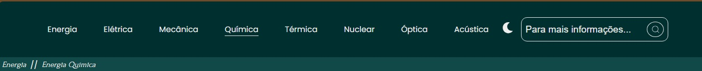
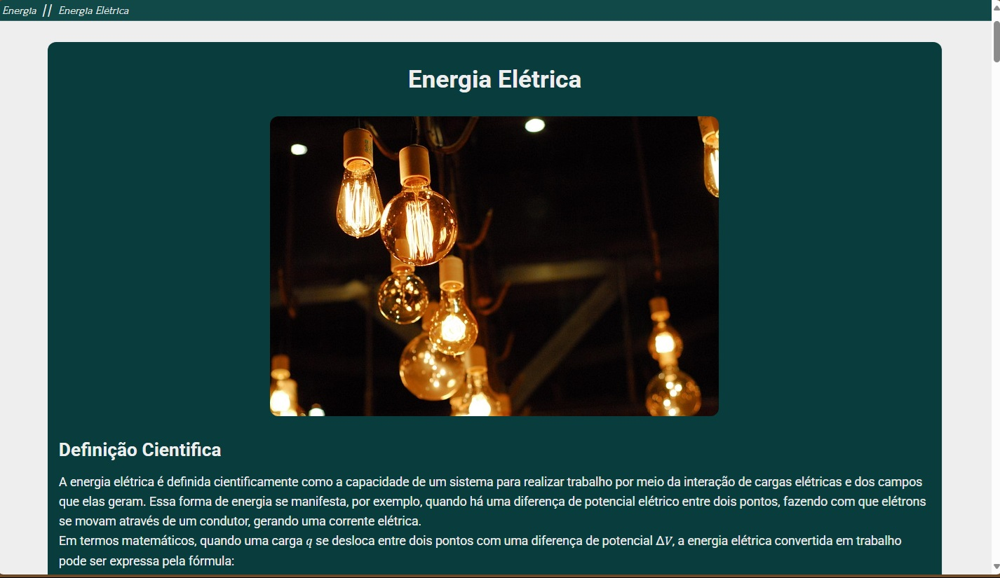
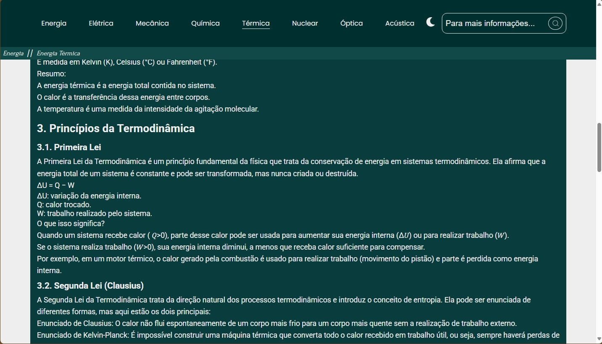

# Energia
 O projeto é um website informativo e explicativo sobre o tema "energia", abordando subtemas como energia acústica, térmica, óptica, nuclear, elétrica, mecânica, química. Tem como objetivo principal elucidar e explanar principais conceitos que são recorrentes na área da física e química sobre o tema.

# Estrutura da aplicação

### Header

○ Possui um Header(cabeçalho) com âncoras para redirecionar para as respectivas páginas nomeadas;

○ Botão de alternancia de tema claro/escuro;

○ Input para o usuário pesquisar (API Google) sobre temas de interesse;

○ Breadcrumb para informar usuário de sua localização no site;

○ Header responsivo com efeito de Hide-on-Scroll Header (Aparece/desaparece dependendo do scroll da página)



### Main

○ Texto informativo redirecionado por âncoras do header;

○ Responsivo para todos os tipos de telas;

○ Informativo, abordando de maneira relevante todos os principais conceitos;

#### Corpo de página 1



#### Corpo de página 2



#### Vídeo demonstrativo

[](public/website_energia.mp4)


### Footer

○ Responsivo com o slogan do site;


## Tecnologias Utilizadas

- React
- Vite
- Typescript
- MarkDown
- SCSS.

## Pré-requisitos

- Node.js versão 18+.
- Gerenciador de pacotes: `npm` ou `yarn`.

## Instalação

Passos para instalar o projeto localmente:

```bash

git clone https://github.com/Talisson-matos/energia.git
cd repositorio
npm install
npm run dev
